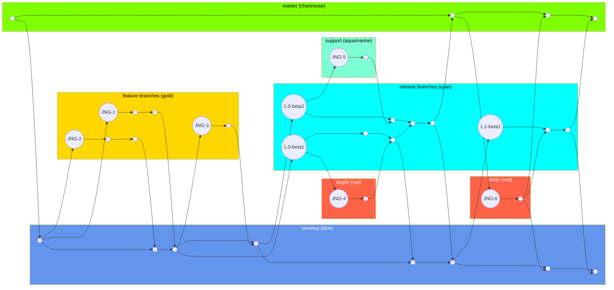
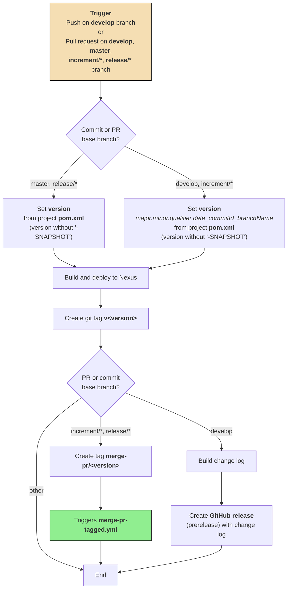
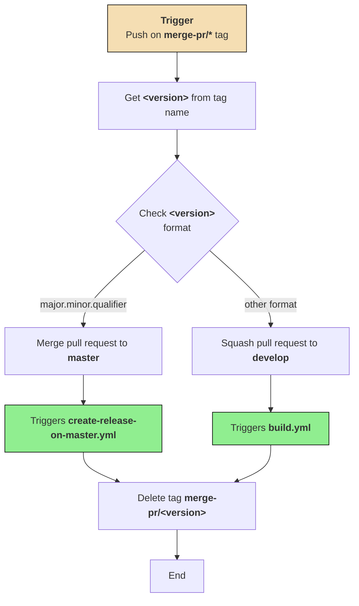
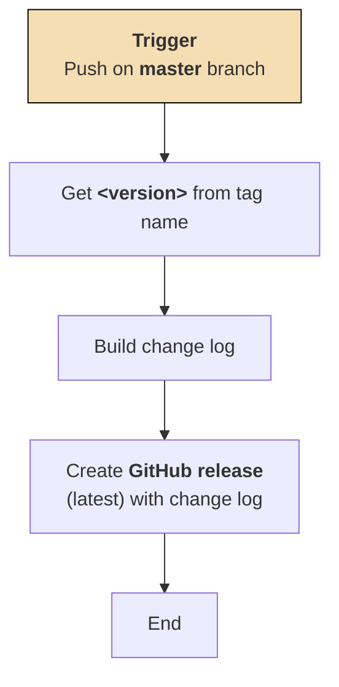
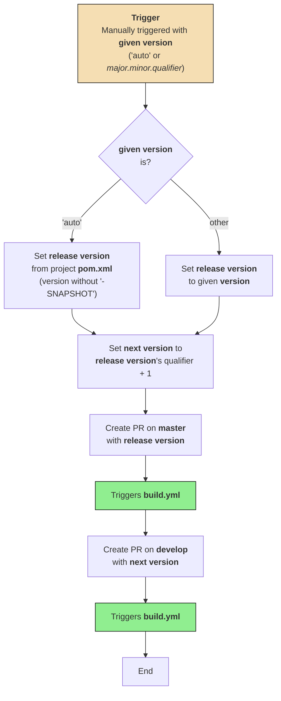

# Development Version and Branch Handling

## Table of Contents

- [Branches](#branches)
- [Version Numbers](#version-numbers)
  - [GitHub Action Flows](#github-action-flows)
    - [build.yml](#buildyml)
    - [merge-pr-tagged.yml](#merge-pr-taggedyml)
    - [create-release-on-master.yml](#create-release-on-masteryml)
    - [release.yml](#releaseyml)
- [How to Develop](#how-to-develop)

---

## Branches

The versioning policy of JUDO NG modules is based on [GitFlow](https://www.atlassian.com/git/tutorials/comparing-workflows/gitflow-workflow).

Branches:

- **develop** -- development branch containing the latest development sources of the last active version
- **feature/JNG-NUMBER_short_summary** -- feature branches are based on **develop** and contain sources of new features that will be included in the last active version
- **(release/)1_0_beta1** -- release branches of 1.0-beta1 (the `release/` prefix is still reserved for CI)
- **bugfix/JNG-NUMBER_short_summary**, **support/JNG-NUMBER_short_summary** -- bugfix and support branches are based on release branches and must be applied to release and development branches of newer versions too
- **master** -- contains the latest released sources of the last active version

The following diagram illustrates the branching model and how branches relate to each other over time:

---

## Version Numbers

Version numbers are managed using semantic versioning. The rules for when and how to change version numbers depend on the branch type:

| Branch Type | Version Rule |
|---|---|
| **feature/** | Do **not** change version numbers when starting feature branches |
| **develop** | 2nd number in version is increased when a release branch is started |
| **bugfix/** | Do **not** change version numbers on bugfix branches -- these are applied on release branches during testing before releasing (merging to master) |
| **support/** | 3rd number in version is increased when started -- used to support a previous release including new (minor) changes; support branches are merged back to the release branch when the update is released (without merging changes to master) |
| **hotfix/** | 4th number in version is increased when started -- these are applied on both release and master branches |

---

### GitHub Action Flows

#### build.yml

The `build.yml` workflow is the primary build pipeline. It is triggered on pushes to the **develop** branch or on pull requests targeting **develop**, **master**, **increment/\***, or **release/\*** branches. The version calculation strategy depends on the target branch.

---

#### merge-pr-tagged.yml

The `merge-pr-tagged.yml` workflow is triggered when a tag matching `merge-pr/*` is pushed. It determines whether to merge the associated pull request to **master** or squash it to **develop** based on the version format.

---

#### create-release-on-master.yml

The `create-release-on-master.yml` workflow is triggered on any push to the **master** branch. It creates a GitHub release marked as the latest release, including a generated changelog.

---

#### release.yml

The `release.yml` workflow is triggered manually with a **given version** parameter, which can be `'auto'` or any version in `major.minor.qualifier` form. It creates two pull requests: one targeting **master** with the release version and one targeting **develop** with the next incremented version.

---

## How to Develop

For issue tracking we use [JIRA](https://blackbelt.atlassian.net/jira/dashboards). The golden rule:

> **There is no commit without ticket number.**

Every pull request or commit must include a `JNG-xxx` ticket reference.
