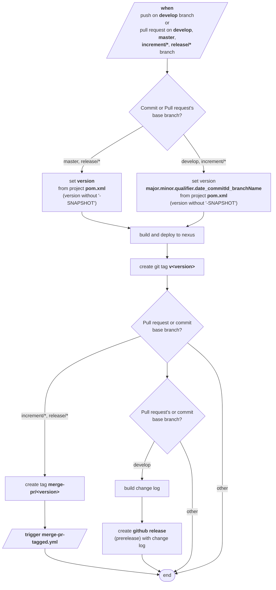
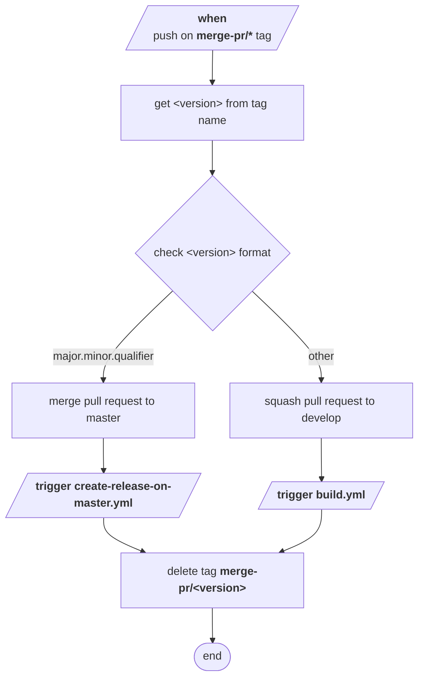
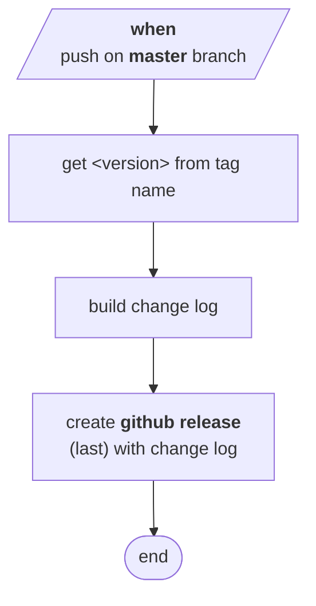
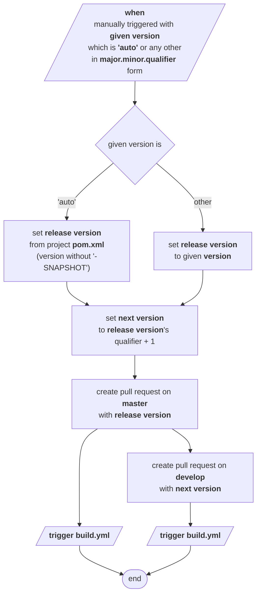

# Development version and branch handling

## Table of Contents
- [Branches](#branches)
- [Version numbers](#version-numbers)
- [How to develop](#how-to-develop)

## Branches

Versioning policy of JUDO NG modules are based on GitFlow: https://www.atlassian.com/git/tutorials/comparing-workflows/gitflow-workflow.

Branches:

- **develop**: development branch contains latest development sources of the last active version
- **feature/JNG-NUMBER_short_summary**: feature branches are based on **develop** and contains sources of new features that will be included in last active version
- **(release/)1_0_beta1**: release branches of 1.0-beta1 (release/ prefix is still reserved for CI)
- **bugfix/JNG-NUMBER_short_summary**, **support/JNG-NUMBER_short_summary**: bugfix and support branches are based on release branches and must be applied to release and development branches of newer versions too
- **master**: contains latest released sources of the last active version

### branches.yml

```mermaid
%%{init: {'theme': 'base', 'gitGraph': {'rotateCommitLabel': false}}}%%
gitGraph
    commit id: "master" tag: "master"
    branch develop
    checkout develop
    commit id: "1"
    branch feature/JNG-2
    checkout feature/JNG-2
    commit id: "2"
    commit id: "3"
    checkout develop
    merge feature/JNG-2 id: "7"
    branch feature/JNG-1
    checkout feature/JNG-1
    commit id: "4"
    commit id: "5"
    commit id: "6"
    checkout develop
    merge feature/JNG-1 id: "8"
    branch feature/JNG-3
    checkout feature/JNG-3
    commit id: "12"
    commit id: "13"
    checkout develop
    merge feature/JNG-3 id: "9"
    branch release/1.0-beta1
    checkout release/1.0-beta1
    commit id: "14"
    branch bugfix/JNG-4
    checkout bugfix/JNG-4
    commit id: "17"
    commit id: "18"
    checkout release/1.0-beta1
    merge bugfix/JNG-4 id: "16"
    checkout develop
    merge release/1.0-beta1 id: "10"
    commit id: "11"
    branch release/1.0-beta2
    checkout release/1.0-beta2
    commit id: "19"
    branch support/JNG-5
    checkout support/JNG-5
    commit id: "23"
    commit id: "24"
    checkout release/1.0-beta2
    merge support/JNG-5 id: "20"
    commit id: "21"
    checkout master
    merge release/1.0-beta2 id: "22"
    branch hotfix/JNG-6
    checkout hotfix/JNG-6
    commit id: "26"
    checkout master
    merge hotfix/JNG-6 id: "25"
    checkout develop
    merge hotfix/JNG-6 id: "30"
    branch release/1.1-beta1
    checkout release/1.1-beta1
    commit id: "27"
    commit id: "28"
    commit id: "29"
    checkout develop
    merge release/1.1-beta1 id: "31"
    checkout master
    merge release/1.1-beta1 id: "32"
```

## Version numbers

Version numbers are increased using semantic versioning:

- do not change version numbers on starting feature/ branches
- 2nd number in version of **develop** branch is increased when a release branch started
- do not change version numbers on bugfix/ branches - that are applied on release branches during testing before releasing it (merging to master)
- 3rd number in version of support/ branches is increased when started - it is used to support a previous release including new (minor) changes; support/ branches are merged back to release branch when update is released (without merging changes to master)
- 4th number in version of hotfix/ branches is increased when started (that are applied on both release and master branches)

### GitHub action flows

#### build.yml



#### merge-pr-tagged.yml



#### create-release-on-master.yml



#### release.yml



## How to develop

For issue tracking we are using [JIRA](https://blackbelt.atlassian.net/jira/dashboards). Golden rule:

> **IMPORTANT:** *There is no commit without ticket number*

So for pull request or commit `JNG-xxx` have to be presented in the commit.
