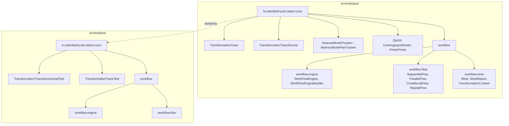
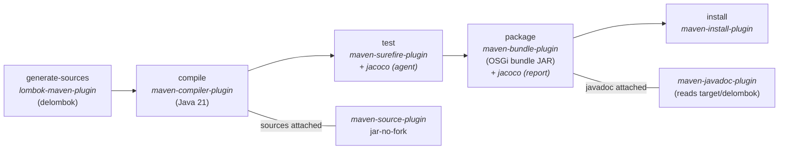

# Contributing to JUDO Tatami Core

Thank you for considering a contribution to **judo-tatami-core** -- the core transformation-trace and workflow-engine module of the JUDO platform. This guide covers everything you need to get started, from setting up your environment to opening a pull request.

---

## Table of Contents

- [Prerequisites](#prerequisites)
- [Code Structure](#code-structure)
- [Build Lifecycle](#build-lifecycle)
- [Commands](#commands)
- [Build Profiles](#build-profiles)
- [Code Quality](#code-quality)
- [Branching and Commit Conventions](#branching-and-commit-conventions)
- [Submission Guidelines](#submission-guidelines)

---

## Prerequisites

### Java

| Requirement | Version |
|---|---|
| JDK | **21** (source and target) |
| Maven | **3.9.4** or later |
| Encoding | UTF-8 |

> **Tip:** A Maven wrapper (`mvnw` / `mvnw.cmd`) is included in the repository root. You can use `./mvnw` instead of a globally installed `mvn` binary to guarantee the correct Maven version.

Please also make sure your development environment complies with the requirements discussed in the parent project's [CONTRIBUTING guide](https://github.com/BlackBeltTechnology/judo-community/blob/develop/CONTRIBUTING.adoc).

### Key Dependencies

| Dependency | Purpose |
|---|---|
| Lombok 1.18.34 | Boilerplate reduction via annotation processing |
| Eclipse EMF | Model representation (Ecore, XMI) |
| OSGi Core 6.0 | Service-component annotations and bundle metadata |
| Guava 30.0-jre | Common utilities |
| SLF4J 2.0 + Logback 1.5 | Logging |

### Test Stack

| Library | Version | Purpose |
|---|---|---|
| JUnit Jupiter | 5.9.1 | Test framework |
| Mockito | 4.8.0 | Mocking |
| Hamcrest | 2.2 | Fluent assertions |

---

## Code Structure

This is a **single-module OSGi bundle** project (packaging type `bundle`). There are no Maven submodules.

```
judo-tatami-core/
├── pom.xml
├── mvnw / mvnw.cmd
├── src/
│   ├── main/java/hu/blackbelt/judo/tatami/core/
│   │   ├── *.java                        # Core API & utilities
│   │   └── workflow/
│   │       ├── engine/                   # WorkFlowEngine, builder, impl
│   │       ├── flow/                     # Flow abstractions (sequential, parallel, conditional, repeat)
│   │       └── work/                     # Work abstractions, TransformationContext, reports
│   └── test/java/hu/blackbelt/judo/tatami/core/
│       ├── *.java                        # Unit tests for core classes
│       └── workflow/
│           ├── engine/                   # Engine tests
│           └── flow/                     # Flow tests
└── target/
    └── delombok/                         # Delombok output (generated)
```

### Project Structure Diagram



---

## Build Lifecycle

The following diagram shows the key Maven phases and the plugins that participate in each one.



> **Note:** The `lombok-maven-plugin` runs during `generate-sources` to produce de-lomboked sources in `target/delombok/`. The `maven-javadoc-plugin` reads from that directory so that generated getters, setters, and builders appear in the published Javadoc.

---

## Commands

### Run All Tests

```bash
./mvnw clean test
```

### Run a Single Test Class

```bash
./mvnw clean test -Dtest=TransformationTraceServiceImplTest
```

### Run a Single Test Method

```bash
./mvnw clean test -Dtest=TransformationTraceServiceImplTest#testMethodName
```

### Run Tests Matching a Pattern

```bash
./mvnw clean test -Dtest="TransformationTrace*"
```

### Full Build (compile + test + package + install to local repo)

```bash
./mvnw clean install
```

### Skip Tests During Build

```bash
./mvnw clean install -DskipTests
```

### Generate Javadoc Only

```bash
./mvnw javadoc:javadoc
```

### Generate JaCoCo Coverage Report

```bash
./mvnw clean verify
# Report is written to target/site/jacoco/index.html
```

> **Tip:** If you prefer using a system-installed Maven instead of the wrapper, replace `./mvnw` with `mvn` in every command above.

---

## Build Profiles

The following Maven profiles are available. Activate them with `-P<profile-id>`.

| Profile | Purpose |
|---|---|
| `sign-artifacts` | GPG-signs all artifacts (required for Central releases) |
| `release-dummy` | Deploys to a local `/tmp` directory for dry-run testing |
| `release-judong` | Deploys snapshots and releases to the JUDO Nexus repository |
| `release-central` | Stages and auto-releases to Maven Central via OSSRH |
| `generate-github-asciidoc-diagrams` | Renders AsciiDoc diagrams to PNG for GitHub documentation |
| `update-source-code-license` | Stamps/updates EPL-2.0 license headers on source files |

---

## Code Quality

| Tool | Configuration |
|---|---|
| **JaCoCo** (0.8.12) | Agent attached during `test`, report generated after tests. Coverage data feeds into SonarQube. |
| **SonarQube** | Analysis runs on the `develop` branch. Execute locally with `./mvnw sonar:sonar` (requires a configured SonarQube server). |
| **Surefire** (3.5.1) | Full stack traces enabled (`trimStackTrace=false`). JVM opens internal modules for reflection-heavy test scenarios. |

---

## Branching and Commit Conventions

This project follows **GitFlow**:

| Branch | Purpose |
|---|---|
| `develop` | Integration branch; SonarQube analysis target |
| `feature/JNG-xxx_Description` | Feature branches |
| `bugfix/JNG-xxx_Description` | Bug-fix branches |
| `release/x.y.z` | Release stabilization |
| `hotfix/JNG-xxx_Description` | Production hotfixes |

> **Important:** Every commit message **must** reference a JIRA ticket number in the `JNG-xxx` format. Example:
>
> ```
> JNG-1234 Add retry logic to TransformationTraceLoader
> ```

---

## Submission Guidelines

### Submitting an Issue

Before you submit an issue, please search the [issue tracker](https://github.com/BlackBeltTechnology/judo-tatami-core/issues). An issue for your problem may already exist and has been resolved, or the discussion might inform you of workarounds readily available.

We want to fix all the issues as soon as possible, but before fixing a bug we need to reproduce and confirm it. Having a reproducible scenario gives us wealth of important information without going back and forth requiring additional information, such as:

- The output of `java -version` and `mvn -version`
- Your `pom.xml` or `.flattened-pom.xml` (when applicable)
- A minimal use-case that fails

A minimal reproduction allows us to quickly confirm a bug (or point out a coding problem) as well as confirm that we are fixing the right problem.

We will be insisting on a minimal reproduction in order to save maintainers' time and ultimately be able to fix more bugs. We understand that sometimes it might be hard to extract essential bits of code from a larger codebase, but we really need to isolate the problem before we can fix it.

You can file new issues by filling out our [issue form](https://github.com/BlackBeltTechnology/judo-tatami-core/issues/new/choose).

### Submitting a Pull Request

This project follows [GitHub's standard forking model](https://guides.github.com/activities/forking/). Please fork the project to submit pull requests.

1. **Fork** the repository and clone your fork locally.
2. Create a feature or bugfix branch from `develop`:
   ```bash
   git checkout -b feature/JNG-xxx_Short_description develop
   ```
3. Make your changes, ensuring each commit message starts with the `JNG-xxx` ticket number.
4. Run the full build locally to verify nothing is broken:
   ```bash
   ./mvnw clean install
   ```
5. Push your branch and open a pull request against the `develop` branch.

---

## License

This project is licensed under the [Eclipse Public License 2.0](https://www.eclipse.org/org/documents/epl-2.0/EPL-2.0.txt).
