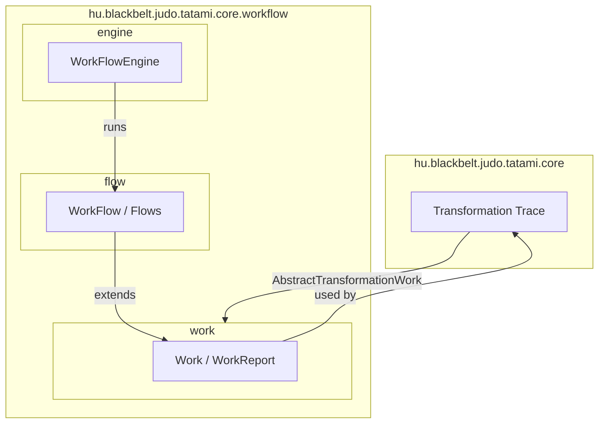
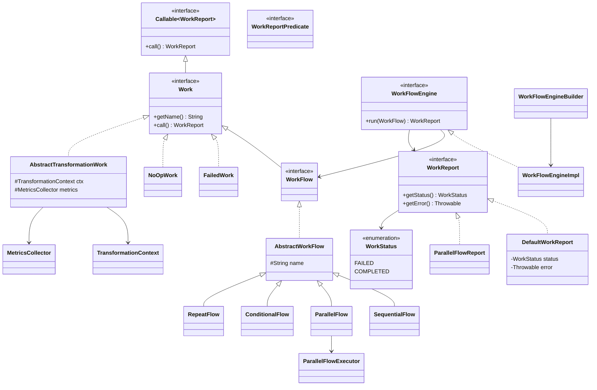
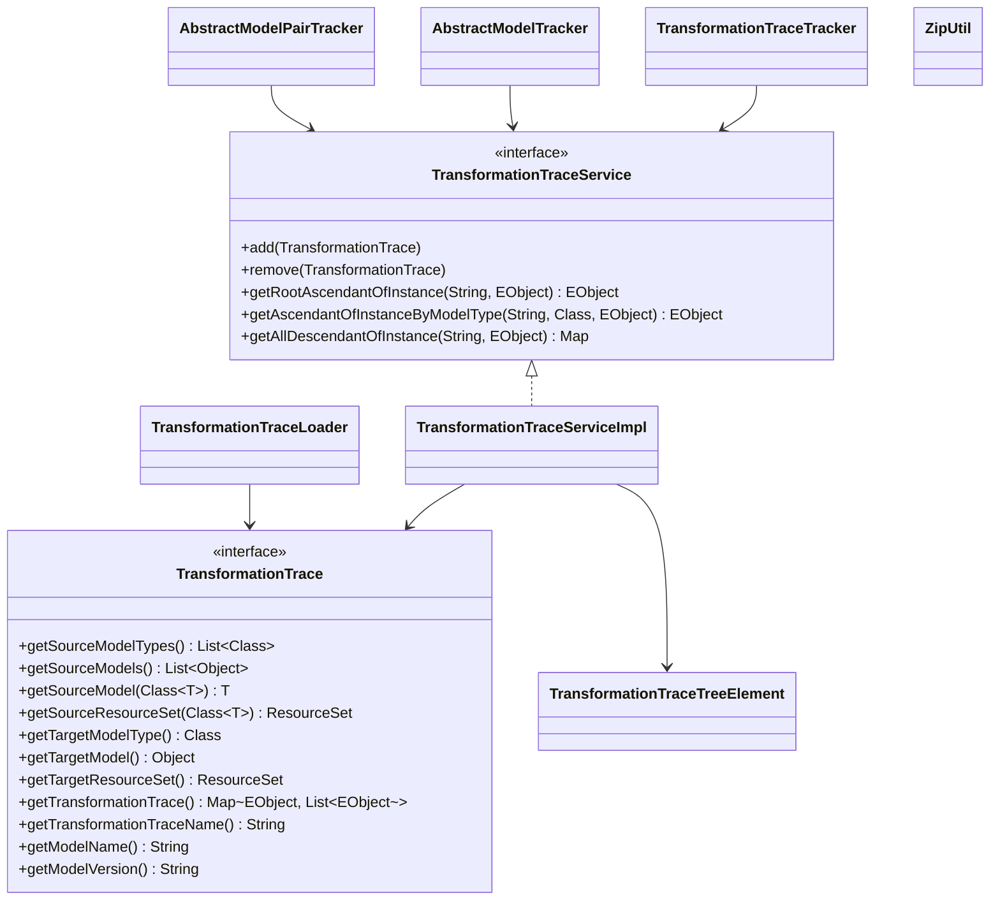
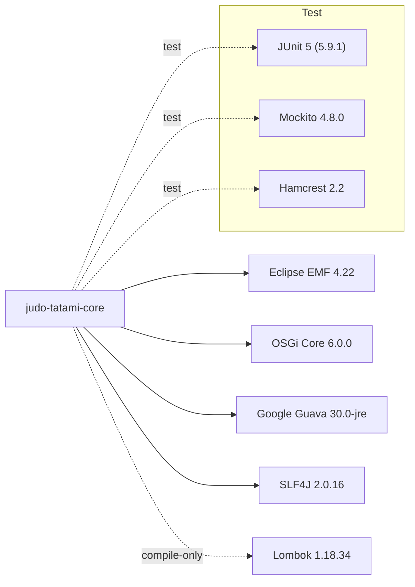

# judo-tatami-core

[](https://github.com/BlackBeltTechnology/judo-tatami-core/actions/workflows/build.yml)

| Property       | Value                                |
|----------------|--------------------------------------|
| **Group ID**   | `hu.blackbelt.judo.tatami`           |
| **Artifact**   | `judo-tatami-core`                   |
| **Version**    | `1.1.4-SNAPSHOT`                     |
| **Packaging**  | OSGi `bundle`                        |
| **Java**       | 21                                   |
| **License**    | EPL-2.0 OR GPL-2.0 WITH Classpath-exception-2.0 |

## Introduction

**judo-tatami-core** provides the foundational utilities consumed by all Tatami transformation modules in the JUDO ecosystem. It ships two main subsystems:

1. **Transformation Trace** -- an EMF-based tracing framework that records which source `EObject` instances produced which target `EObject` instances across a multi-step model transformation pipeline.
2. **Workflow Engine** -- a lightweight, composable work/flow execution engine used to orchestrate those transformations as sequential, parallel, conditional, or repeating flows.

The library is packaged as an OSGi bundle so it can be deployed in both OSGi containers and plain Java (Maven) environments.

## Context

This project is a building block of the [judo-community](https://github.com/BlackBeltTechnology/judo-community) aggregator project. In order to better understand how this module fits into the ecosystem, please check the corresponding documentation.

> **Note:** Other modules whose names contain "tatami" typically depend on this core library.

## Architecture Overview

### Package Map



The **Transformation Trace** subsystem lives directly under `hu.blackbelt.judo.tatami.core`, while the **Workflow Engine** occupies three sub-packages (`work`, `flow`, `engine`) under `hu.blackbelt.judo.tatami.core.workflow`. The two subsystems are connected through `AbstractTransformationWork`, which is a `Work` implementation aware of `TransformationContext`.

---

### Workflow Engine -- Class Diagram



Key design decisions:

- `WorkFlow` extends `Work`, so workflows are **composable** -- any flow can be nested inside another flow.
- `Work.call()` must never throw; implementations catch exceptions internally and return `WorkStatus.FAILED`.
- Four flow types cover the most common orchestration patterns: **sequential**, **parallel**, **conditional**, and **repeat**.

---

### Transformation Trace -- Class Diagram



- `TransformationTrace` captures one step in the pipeline: source models, target model, and the `EObject`-level mapping between them.
- `TransformationTraceService` (OSGi Declarative Services component) aggregates multiple traces and provides ancestor/descendant queries that can traverse the full transformation chain.
- `AbstractModelTracker` and `AbstractModelPairTracker` are OSGi `ServiceTracker` helpers that react to model registrations and automatically wire up traces.

---

### External Dependencies



## Prerequisites

| Requirement    | Version |
|----------------|---------|
| **JDK**        | 21+     |
| **Maven**      | 3.9.4+  |

> **Tip:** The project ships a Maven Wrapper (`mvnw`), so you do not need a global Maven installation.

## Building

```bash
# Full build (compile + test + package)
./mvnw clean install

# Run tests only
./mvnw clean test
```

The build produces an OSGi bundle JAR under `target/`.

## Project Layout

```
src/
 main/java/hu/blackbelt/judo/tatami/core/
  |-- TransformationTrace.java            # Core tracing interface
  |-- TransformationTraceService.java     # Service API for trace queries
  |-- TransformationTraceServiceImpl.java # OSGi DS implementation
  |-- TransformationTraceLoader.java      # Loads trace models from resources
  |-- TransformationTraceTreeElement.java # Tree node for trace hierarchy
  |-- TransformationTraceTracker.java     # OSGi service tracker for traces
  |-- AbstractModelTracker.java           # Generic OSGi model tracker
  |-- AbstractModelPairTracker.java       # Tracker for paired models
  |-- ZipUtil.java                        # ZIP archive helpers
  |-- PrettyPrinter.java                  # Debug formatting utilities
  |-- AnsiColor.java                      # ANSI terminal colors
  |-- EMapWrapper.java                    # EMF EMap convenience wrapper
  |-- CachingInputStream.java             # Reusable input stream
  |
  +-- workflow/
       +-- work/
       |    |-- Work.java                     # Unit-of-work interface
       |    |-- WorkReport.java               # Execution report interface
       |    |-- WorkStatus.java               # FAILED | COMPLETED enum
       |    |-- DefaultWorkReport.java         # Standard report impl
       |    |-- FailedWork.java               # Always-failing sentinel
       |    |-- NoOpWork.java                 # No-op sentinel
       |    |-- WorkReportPredicate.java      # Predicate over reports
       |    |-- AbstractTransformationWork.java # Base for transformation steps
       |    |-- TransformationContext.java     # Shared context map
       |    +-- MetricsCollector.java         # Timing / metrics helper
       |
       +-- flow/
       |    |-- WorkFlow.java                 # Flow interface (extends Work)
       |    |-- AbstractWorkFlow.java         # Base flow implementation
       |    |-- SequentialFlow.java           # Execute works in order
       |    |-- ParallelFlow.java             # Execute works concurrently
       |    |-- ConditionalFlow.java          # Branch on predicate
       |    |-- RepeatFlow.java               # Loop until predicate
       |    |-- ParallelFlowExecutor.java     # Thread pool for ParallelFlow
       |    +-- ParallelFlowReport.java       # Aggregated parallel report
       |
       +-- engine/
            |-- WorkFlowEngine.java           # Engine interface
            |-- WorkFlowEngineImpl.java       # Default engine impl
            +-- WorkFlowEngineBuilder.java    # Fluent builder
```

## Usage Examples

### Running a Sequential Workflow

```java
import hu.blackbelt.judo.tatami.core.workflow.flow.SequentialFlow;
import hu.blackbelt.judo.tatami.core.workflow.engine.WorkFlowEngineBuilder;
import hu.blackbelt.judo.tatami.core.workflow.work.*;

Work step1 = new NoOpWork();
Work step2 = new NoOpWork();

WorkFlow flow = SequentialFlow.Builder.aNewSequentialFlow()
        .named("my-pipeline")
        .execute(step1)
        .then(step2)
        .build();

WorkFlowEngine engine = WorkFlowEngineBuilder.aNewWorkFlowEngine().build();
WorkReport report = engine.run(flow);

System.out.println("Status: " + report.getStatus()); // COMPLETED
```

### Querying Transformation Traces

```java
import hu.blackbelt.judo.tatami.core.TransformationTraceService;
import org.eclipse.emf.ecore.EObject;

// Given an OSGi-injected or manually constructed service
TransformationTraceService traceService = ...;

// Find the root ancestor of a target element
EObject root = traceService.getRootAscendantOfInstance("myModel", targetElement);

// Walk all descendants from a source element
Map<TransformationTrace, List<EObject>> descendants =
        traceService.getAllDescendantOfInstance("myModel", sourceElement);
```

## Contributing

Everyone is welcome to contribute to JUDO! As a starter, please read the [CONTRIBUTING](CONTRIBUTING.md) guide for details.

## License

This project is licensed under the [Eclipse Public License - v 2.0](https://www.eclipse.org/legal/epl-2.0/).

```
SPDX-License-Identifier: EPL-2.0 OR GPL-2.0 WITH Classpath-exception-2.0
```
