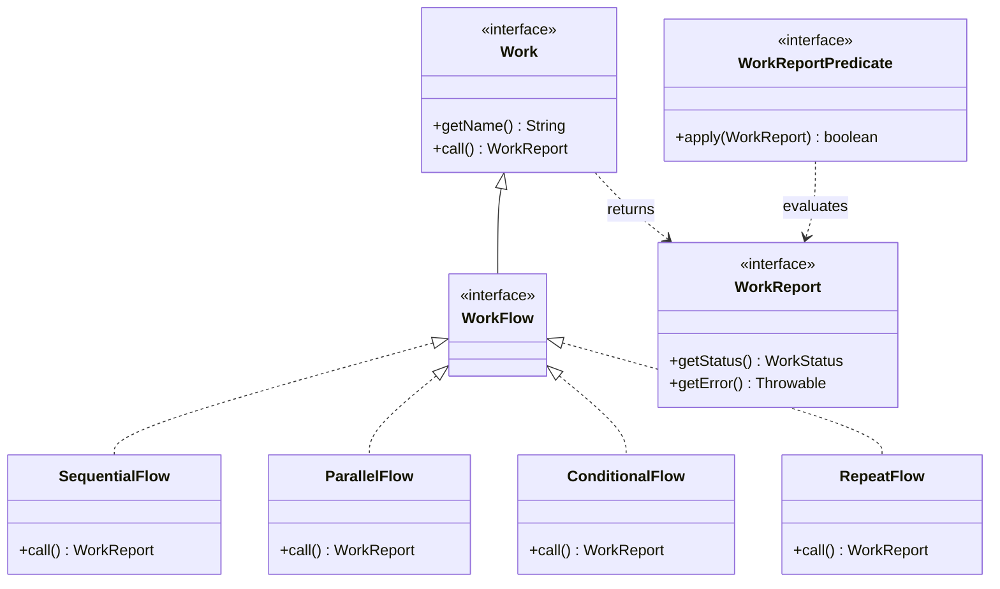
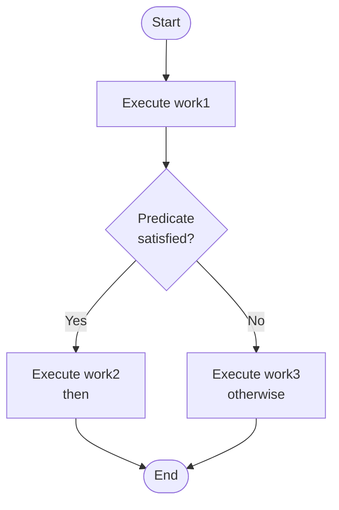
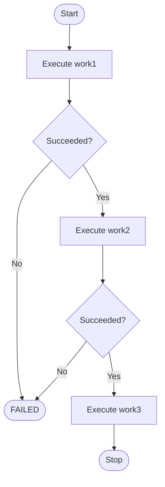
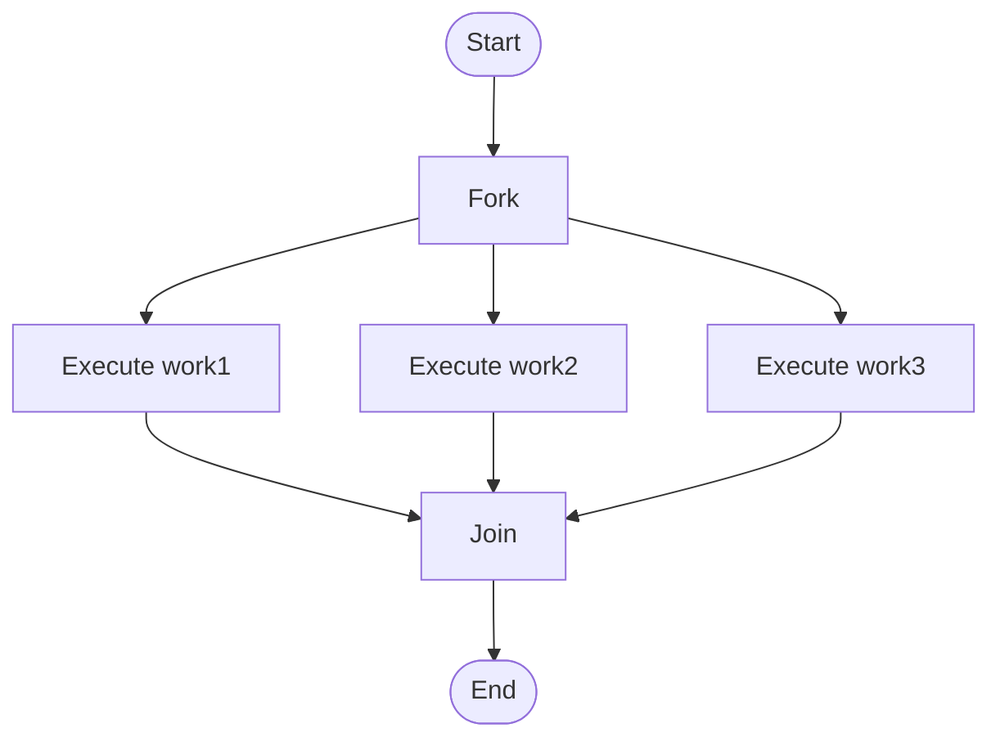
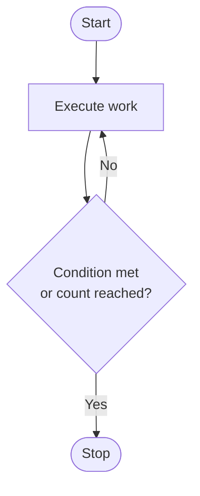
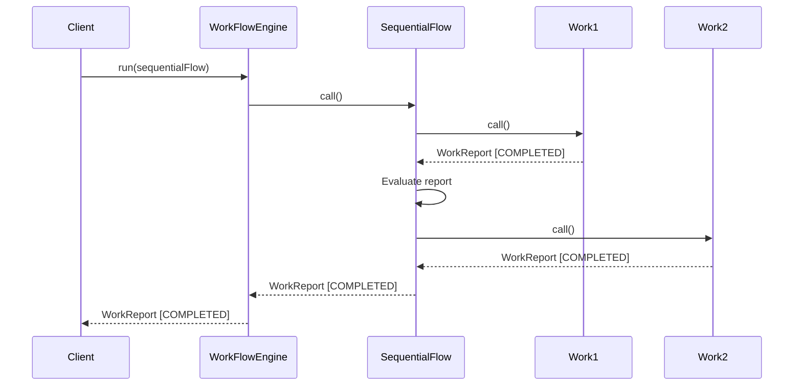
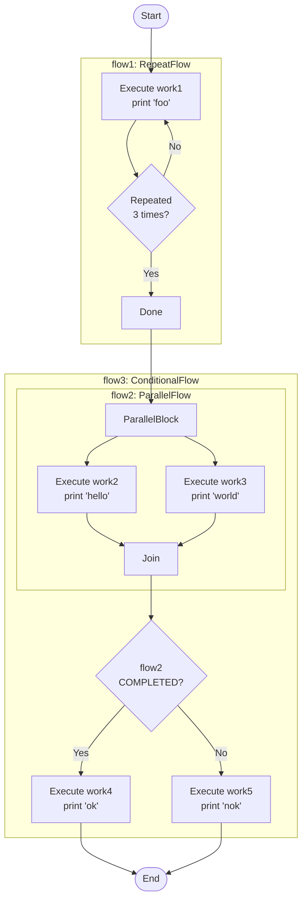

# Workflow Engine Guide

This document provides a comprehensive guide to the Workflow Engine API, covering the core abstractions, built-in flow types, and how to compose them into complex workflows.

---

## Table of Contents

- [WorkFlowEngine API](#workflowengine-api)
- [WorkFlow API](#workflow-api)
- [Type Hierarchy](#type-hierarchy)
- [Built-in Flows](#built-in-flows)
  - [ConditionalFlow](#conditional-flow)
  - [SequentialFlow](#sequential-flow)
  - [ParallelFlow](#parallel-flow)
  - [RepeatFlow](#repeat-flow)
- [Creating Custom Flows](#creating-custom-flows)
- [The Work Abstraction](#the-work-abstraction)
- [Execution Sequence](#execution-sequence)
- [Tutorial](#tutorial)

---

## WorkFlowEngine API

The `WorkFlowEngine` interface represents the entry point for executing workflows:

```java
public interface WorkFlowEngine {

    WorkReport run(WorkFlow workFlow);

}
```

An implementation of this interface is obtained through the `WorkFlowEngineBuilder`:

```java
WorkFlowEngine workFlowEngine = aNewWorkFlowEngine().build();
```

You can then execute a `WorkFlow` by invoking the `run` method:

```java
WorkFlow workFlow = ... // create work flow
WorkReport workReport = workFlowEngine.run(workFlow);
```

At the end of execution, a `WorkReport` is returned containing the status of the workflow run.

---

## WorkFlow API

A workflow is represented by the `WorkFlow` interface:

```java
public interface WorkFlow extends Work {

}
```

A workflow is also a work. This is what makes workflows **composable** -- any workflow can be used as a unit of work inside another workflow.

---

## Type Hierarchy

The following class diagram shows the relationships between the core types in the Workflow Engine:



---

## Built-in Flows

The Workflow Engine comes with four implementations of the `WorkFlow` interface:

| Flow Type         | Description                                                        |
|-------------------|--------------------------------------------------------------------|
| `ConditionalFlow` | Executes work, then branches based on a predicate                  |
| `SequentialFlow`  | Executes a series of works one after another                       |
| `ParallelFlow`    | Executes a set of works concurrently                               |
| `RepeatFlow`      | Loops a unit of work until a condition is met or a count is reached |

### Conditional Flow

A conditional flow is defined by four artifacts:

- The work to execute first
- A `WorkReportPredicate` for the conditional logic
- The work to execute if the predicate is satisfied (`then`)
- The work to execute if the predicate is not satisfied (`otherwise`, optional)

When the `WorkReportPredicate` is not satisfied and the `otherwise` work is not defined, the flow execution becomes **failed**.



To create a `ConditionalFlow`, use the `ConditionalFlow.Builder`:

```java
ConditionalFlow conditionalFlow = ConditionalFlow.Builder.aNewConditionalFlow()
        .named("my conditional flow")
        .execute(work1)
        .when(WorkReportPredicate.COMPLETED)
        .then(work2)
        .otherwise(work3)
        .build();
```

### Sequential Flow

A `SequentialFlow` executes a set of work units in sequence. If a work fails, the remaining works in the pipeline are skipped.



To create a `SequentialFlow`, use the `SequentialFlow.Builder`:

```java
SequentialFlow sequentialFlow = SequentialFlow.Builder.aNewSequentialFlow()
        .named("execute 'work1', 'work2' and 'work3' in sequence")
        .execute(work1)
        .then(work2)
        .then(work3)
        .build();
```

### Parallel Flow

A parallel flow executes a set of works concurrently. The status of a parallel flow execution is defined as follows:

| Condition             | Resulting Status         |
|-----------------------|--------------------------|
| All works completed   | `WorkStatus.COMPLETED`   |
| Any work failed       | `WorkStatus.FAILED`      |



To create a `ParallelFlow`, use the `ParallelFlow.Builder`:

```java
ParallelFlow parallelFlow = ParallelFlow.Builder.aNewParallelFlow()
        .named("execute 'work1', 'work2' and 'work3' in parallel")
        .execute(work1, work2, work3)
        .build();
```

### Repeat Flow

A `RepeatFlow` executes a given work in a loop until a condition becomes `true` or for a fixed number of times. The condition is expressed using a `WorkReportPredicate`.



To create a `RepeatFlow`, use the `RepeatFlow.Builder`:

```java
// Repeat a fixed number of times
RepeatFlow repeatFlow = RepeatFlow.Builder.aNewRepeatFlow()
        .named("execute work 3 times")
        .repeat(work)
        .times(3)
        .build();

// or repeat until a predicate is satisfied
RepeatFlow repeatFlow = RepeatFlow.Builder.aNewRepeatFlow()
        .named("execute work forever!")
        .repeat(work)
        .until(WorkReportPredicate.ALWAYS_TRUE)
        .build();
```

These are the basic flows you need to know to start creating workflows. You don't need to learn a complex notation or concepts -- just a few natural APIs that are easy to think about.

---

## Creating Custom Flows

You can create your own flows by implementing the `WorkFlow` interface. The `WorkFlowEngine` works against interfaces, so your custom implementation will be interoperable with the built-in flows without any issue.

```java
public class MyCustomFlow implements WorkFlow {

    @Override
    public String getName() {
        return "my custom flow";
    }

    @Override
    public WorkReport call() {
        // Custom execution logic here
        return new DefaultWorkReport(WorkStatus.COMPLETED);
    }
}
```

---

## The Work Abstraction

A unit of work is represented by the `Work` interface:

```java
public interface Work extends Callable<WorkReport> {

    String getName();

    WorkReport call();
}
```

Implementations of this interface must adhere to the following rules:

| Rule | Description |
|------|-------------|
| Exception handling | Catch all exceptions and return `WorkStatus.FAILED` in the `WorkReport` |
| Finite execution | The work must finish in a finite amount of time |
| Unique naming | A work name must be unique within a workflow |

Each work must return a `WorkReport` at the end of execution. This report may serve as a condition to the next work in the workflow through a `WorkReportPredicate`.

---

## Execution Sequence

The following sequence diagram illustrates how the `WorkFlowEngine` executes a `SequentialFlow` containing two work units:



---

## Tutorial

This tutorial walks through composing all four built-in flow types into a single workflow.

### Step 1: Define a Work Unit

First, create a simple unit of work that prints a message:

```java
class PrintMessageWork implements Work {

    private String message;

    public PrintMessageWork(String message) {
        this.message = message;
    }

    public String getName() {
        return "print message work";
    }

    public WorkReport call() {
        System.out.println(message);
        return new DefaultWorkReport(WorkStatus.COMPLETED);
    }
}
```

### Step 2: Design the Workflow

The goal is to create the following workflow:

1. Print "foo" three times
2. Then print "hello" and "world" in parallel
3. Then, if both "hello" and "world" have been successfully printed, print "ok"; otherwise print "nok"

### Step 3: Visualize the Composite Workflow



### Step 4: Understand the Flow Composition

| Flow   | Type              | Description                                                                 |
|--------|-------------------|-----------------------------------------------------------------------------|
| `flow1` | `RepeatFlow`     | Repeats `work1` (prints "foo") three times                                  |
| `flow2` | `ParallelFlow`   | Executes `work2` (prints "hello") and `work3` (prints "world") in parallel  |
| `flow3` | `ConditionalFlow` | Executes `flow2`, then runs `work4` ("ok") or `work5` ("nok") based on result |
| `flow4` | `SequentialFlow`  | Executes `flow1` followed by `flow3` in sequence                            |

Note that `flow3` takes `flow2` as its initial work -- this demonstrates the composability of workflows, since a `WorkFlow` is also a `Work`.

### Step 5: Implement the Workflow

```java
PrintMessageWork work1 = new PrintMessageWork("foo");
PrintMessageWork work2 = new PrintMessageWork("hello");
PrintMessageWork work3 = new PrintMessageWork("world");
PrintMessageWork work4 = new PrintMessageWork("ok");
PrintMessageWork work5 = new PrintMessageWork("nok");

WorkFlow workflow = aNewSequentialFlow() // flow 4
        .execute(aNewRepeatFlow() // flow 1
                    .named("print foo 3 times")
                    .repeat(work1)
                    .times(3)
                    .build())
        .then(aNewConditionalFlow() // flow 3
                .execute(aNewParallelFlow() // flow 2
                            .named("print 'hello' and 'world' in parallel")
                            .execute(work2, work3)
                            .build())
                .when(WorkReportPredicate.COMPLETED)
                .then(work4)
                .otherwise(work5)
                .build())
        .build();

WorkFlowEngine workFlowEngine = aNewWorkFlowEngine().build();
WorkReport workReport = workFlowEngine.run(workflow);
```
