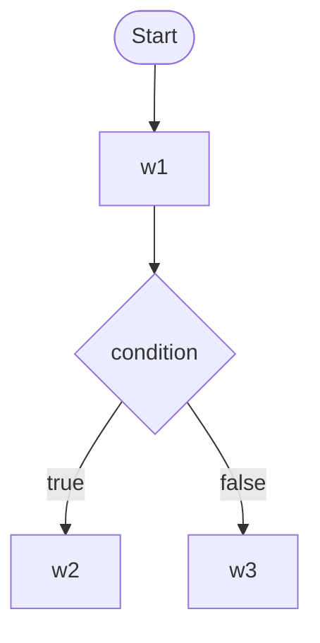
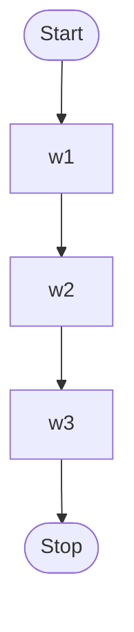
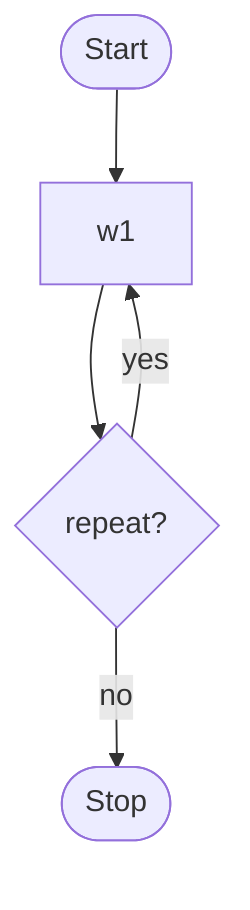
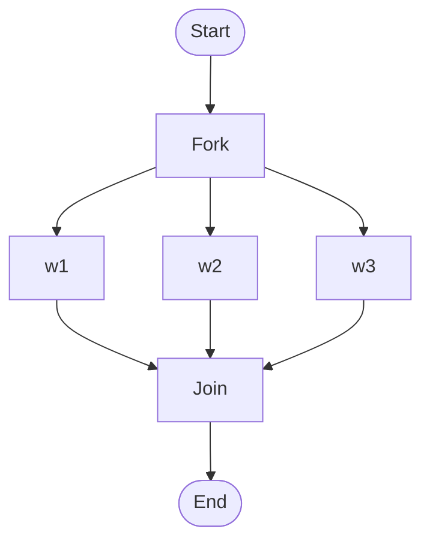
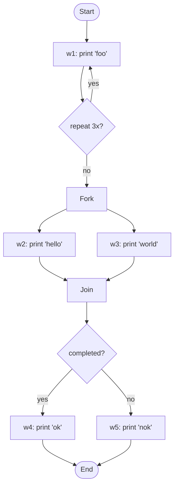

# Workflow Documentation

## The `WorkFlowEngine` API

The `WorkFlowEngine` interface represents a workflow engine:

```java
public interface WorkFlowEngine {

    WorkReport run(WorkFlow workFlow);

}
```

Workflow provides an implementation of this interface that you can get using the `WorkFlowEngineBuilder`:

```java
WorkFlowEngine workFlowEngine = aNewWorkFlowEngine().build();
```

You can then execute a `WorkFlow` by invoking the `run` method:

```java
WorkFlow workFlow = ... // create work flow
WorkReport workReport = workFlowEngine.run(workflow);
```

At the end of execution, a `WorkReport` is returned.

## The `WorkFlow` API

A work flow in Easy Flows is represented by the `WorkFlow` interface:

```java
public interface WorkFlow extends Work {

}
```

A workflow is also a work. This what makes workflows composable.

## Built-in flows

Easy Flows comes with 4 implementations of the `WorkFlow` interface:

### Conditional flow



### Sequential flow



### Repeat flow



### Parallel flow



### Conditional flow details

A conditional flow is defined by 4 artifacts:

- The work to execute first
- A `WorkReportPredicate` for the conditional logic
- The work to execute if the predicate is satisfied
- The work to execute if the predicate is not satisfied (optional)

When the `WorkReportPredicate` not satisfied and the not satisfied artifact is not defined the flow execution become failed.

To create a `ConditionalFlow`, you can use the `ConditionalFlow.Builder`:

```java
ConditionalFlow conditionalFlow = ConditionalFlow.Builder.aNewConditionalFlow()
        .named("my conditional flow")
        .execute(work1)
        .when(WorkReportPredicate.COMPLETED)
        .then(work2)
        .otherwise(work3)
        .build();
```

### Sequential flow details

A `SequentialFlow`, as its name implies, executes a set of work units in sequence. If a work fails, next works in the pipeline will be skipped. To create a `SequentialFlow`, you can use the `SequentialFlow.Builder`:

```java
SequentialFlow sequentialFlow = SequentialFlow.Builder.aNewSequentialFlow()
        .named("execute 'work1', 'work2' and 'work3' in sequence")
        .execute(work1)
        .then(work2)
        .then(work3)
        .build();
```

### Parallel flow details

A parallel flow executes a set of works in parallel. The status of a parallel flow execution is defined as:

- `WorkStatus#COMPLETED`: If all works have successfully completed
- `WorkStatus#FAILED`: If one of the works has failed

To create a `ParallelFlow`, you can use the `ParallelFlow.Builder`:

```java
ParallelFlow parallelFlow = ParallelFlow.Builder.aNewParallelFlow()
        .named("execute 'work1', 'work2' and 'work3' in parallel")
        .execute(work1, work2, work3)
        .build();
```

### Repeat flow details

A `RepeatFlow` executes a given work in loop until a condition becomes `true` or for a fixed number of times. The condition is expressed using a `WorkReportPredicate`. To create a `RepeatFlow`, you can use the `RepeatFlow.Builder`:

```java
RepeatFlow repeatFlow = RepeatFlow.Builder.aNewRepeatFlow()
        .named("execute work 3 times")
        .repeat(work)
        .times(3)
        .build();

// or

RepeatFlow repeatFlow = RepeatFlow.Builder.aNewRepeatFlow()
        .named("execute work forever!")
        .repeat(work)
        .until(WorkReportPredicate.ALWAYS_TRUE)
        .build();
```

Those are the basic flows you need to know to start creating workflows with Easy Flows. You don't need to learn a complex notation or concepts, just a few natural APIs that are easy to think about.

## Creating custom flows

You can create your own flows by implementing the `WorkFlow` interface. The `WorkFlowEngine` works against interfaces, so your implementation should be interoperable with built-in flows without any issue.

## The `Work` abstraction and its related APIs

A unit of work in Easy Flows is represented by the `Work` interface:

```java
public interface Work extends Callable<WorkReport> {

    String getName();

    WorkReport call();
}
```

Implementations of this interface must:

- catch exceptions and return `WorkStatus#FAILED` in the `WorkReport`
- make sure the work in finished in a finite amount of time

A work name must be unique within a workflow. Each work must return a `WorkReport` at the end of execution. This report may serve as a condition to the next work in the workflow through a `WorkReportPredicate`.

## Tutorial

This a simple tutorial about Workflow key APIs. First let's write some work:

```java
class PrintMessageWork implements Work {

    private String message;

    public PrintMessageWork(String message) {
        this.message = message;
    }

    public String getName() {
        return "print message work";
    }

    public WorkReport call() {
        System.out.println(message);
        return new DefaultWorkReport(WorkStatus.COMPLETED);
    }
}
```

This unit of work prints a given message to the standard output. Now let's suppose we want to create the following workflow:

1. print "foo" three times
2. then print "hello" and "world" in parallel
3. then if both "hello" and "world" have been successfully printed to the console, print "ok", otherwise print "nok"

This workflow can be illustrated as follows:

### Tutorial flow



- `flow1` is a `RepeatFlow` of `work1` which is printing "foo" three times
- `flow2` is a `ParallelFlow` of `work2` and `work3` which respectively print "hello" and "world" in parallel
- `flow3` is a `ConditionalFlow`. It first executes `flow2` (a workflow is a also a work), then if `flow2` is completed, it executes `work4`, otherwise `work5` which respectively print "ok" and "nok"
- `flow4` is a `SequentialFlow`. It executes `flow1` then `flow3` in sequence.

This workflow can be implemented with the following snippet:

```java
PrintMessageWork work1 = new PrintMessageWork("foo");
PrintMessageWork work2 = new PrintMessageWork("hello");
PrintMessageWork work3 = new PrintMessageWork("world");
PrintMessageWork work4 = new PrintMessageWork("ok");
PrintMessageWork work5 = new PrintMessageWork("nok");

WorkFlow workflow = aNewSequentialFlow() // flow 4
        .execute(aNewRepeatFlow() // flow 1
                    .named("print foo 3 times")
                    .repeat(work1)
                    .times(3)
                    .build())
        .then(aNewConditionalFlow() // flow 3
                .execute(aNewParallelFlow() // flow 2
                            .named("print 'hello' and 'world' in parallel")
                            .execute(work2, work3)
                            .build())
                .when(WorkReportPredicate.COMPLETED)
                .then(work4)
                .otherwise(work5)
                .build())
        .build();

WorkFlowEngine workFlowEngine = aNewWorkFlowEngine().build();
WorkReport workReport = workFlowEngine.run(workflow);
```
