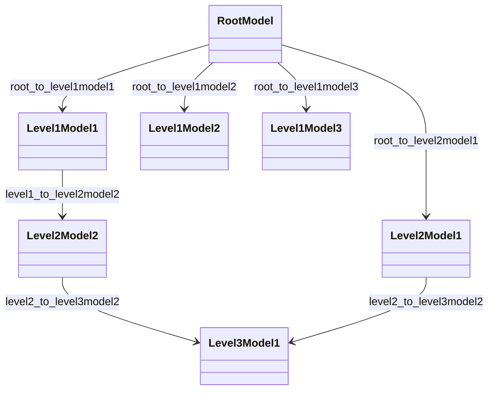

# Test class diagram

The name of the edge contains the TransformationTrace which makes the conversation.

## Conversion diagram

```mermaid
classDiagram
    RootModel --> Level1Model1 : root_to_level1model1
    RootModel --> Level1Model2 : root_to_level1model2
    RootModel --> Level1Model3 : root_to_level1model3
    RootModel --> Level2Model1 : root_to_level2model1
    Level1Model1 --> Level2Model2 : level1_to_level2model2
    Level2Model2 --> Level3Model1 : level2_to_level3model2
    Level2Model1 --> Level3Model1 : level2_to_level3model2
```
